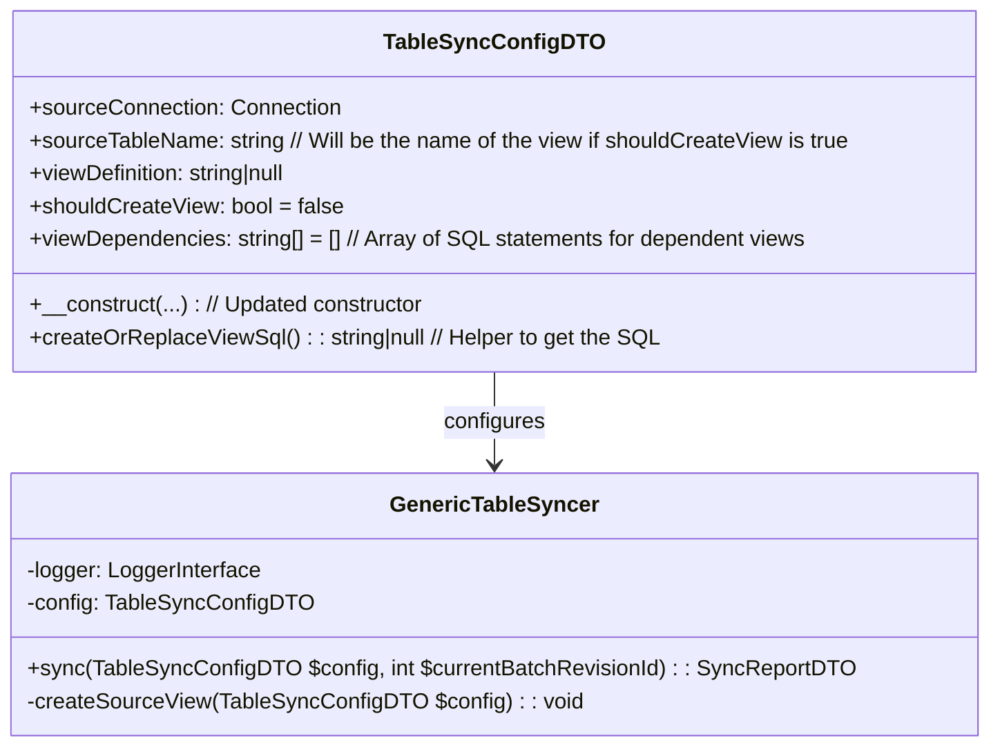
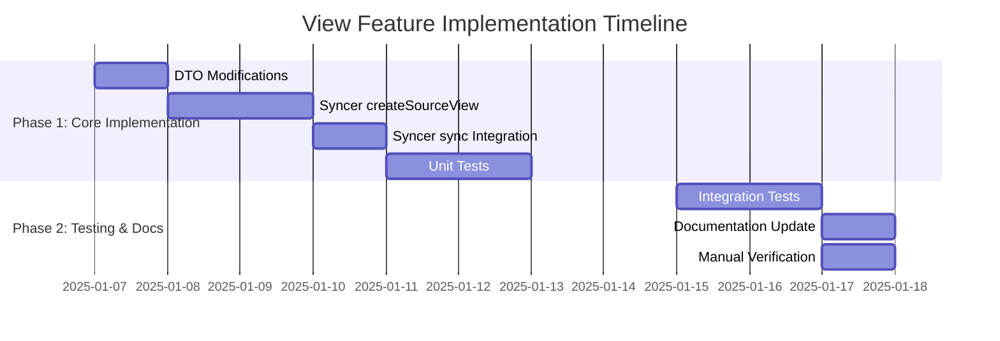

## **Revised Implementation Plan: Table Syncer View Creation Feature**

## 1. Overview
Enhance the `GenericTableSyncer` to support automatic creation or replacement of source views as part of the synchronization process. This feature allows exporter configurations to define their source views directly, simplifying setup and maintenance. The `config->sourceTableName` will then refer to this (potentially newly created) view.

## 2. Architecture Changes


## 3. Implementation Steps

### Step 1: Modify `TableSyncConfigDTO`
**File**: `src/DTO/TableSyncConfigDTO.php`

*   **Add new properties:**
    ```php
    /** @var string|null SQL definition for creating/replacing the source view. */
    public ?string $viewDefinition = null;

    /** @var bool Whether to attempt creation/replacement of the source view before syncing. */
    public bool $shouldCreateView = false;

    /** @var string[] Array of SQL statements to create/replace dependent views. Executed before the main viewDefinition. */
    public array $viewDependencies = [];
    ```

*   **Update Constructor:** Add new properties as optional parameters.
    ```php
    public function __construct(
        Connection $sourceConnection,
        string $sourceTableName, // This will be the name of the table OR the view to be created/used
        array $primaryKeyColumnMap,
        array $dataColumnMapping,
        Connection $targetConnection,
        string $targetLiveTableName,
        array $columnsForContentHash,
        ?MetadataColumnNamesDTO $metadataColumns = null,
        array $nonNullableDatetimeSourceColumns = [],
        ?string $targetTempTableName = null,
        ?string $placeholderDatetime = null,
        bool $enableDeletionLogging = false,
        ?string $targetDeletedLogTableName = null,
        // New parameters for view creation
        ?string $viewDefinition = null,
        bool $shouldCreateView = false,
        array $viewDependencies = []
    ) {
        // ... existing assignments ...
        $this->viewDefinition = $viewDefinition;
        $this->shouldCreateView = $shouldCreateView;
        $this->viewDependencies = $viewDependencies;

        // ... existing validation ...
        // Potentially add validation: if $shouldCreateView is true, $viewDefinition must not be empty.
        if ($this->shouldCreateView && empty(trim((string)$this->viewDefinition))) {
            throw new \InvalidArgumentException('If shouldCreateView is true, viewDefinition cannot be empty.');
        }
        // Potentially add validation: if $shouldCreateView is true, $sourceTableName must be set (as it's the view name).
        if ($this->shouldCreateView && empty(trim($this->sourceTableName))) {
            throw new \InvalidArgumentException('If shouldCreateView is true, sourceTableName (representing the view name) cannot be empty.');
        }
    }
    ```
    *(Self-correction: `createOrReplaceView(Connection $conn): void` method originally planned for DTO is better handled directly in `GenericTableSyncer` as it involves external operations and logging, or the DTO could provide the SQL and the syncer executes it).*

### Step 2: Update `GenericTableSyncer`
**File**: `src/Service/GenericTableSyncer.php`

*   **Modify `sync()` method:** Integrate the view creation step.
    ```php
    public function sync(TableSyncConfigDTO $config, int $currentBatchRevisionId): SyncReportDTO
    {
        $targetConn = $config->targetConnection;
        $report = new SyncReportDTO(); // Initialize report DTO

        try {
            $this->logger->info('Starting sync process', [
                'source'        => $config->sourceTableName, // This is now potentially a view name
                'target'        => $config->targetLiveTableName,
                'batchRevision' => $currentBatchRevisionId,
                'shouldCreateView' => $config->shouldCreateView,
            ]);

            // 1. Create/Replace source view if configured
            $this->createSourceView($config); // New method call

            // 2. Ensure live table exists with correct schema
            $this->schemaManager->ensureLiveTable($config);

            // 2.1 Ensure deleted log table exists if deletion logging is enabled
            if ($config->enableDeletionLogging) {
                $this->logger->info('Deletion logging is enabled, ensuring deleted log table exists');
                $this->schemaManager->ensureDeletedLogTable($config);
            }

            // 3. Prepare temp table (drop if exists, create new)
            $this->schemaManager->prepareTempTable($config); // Uses config->sourceTableName (which is now the view)

            // 4. Load data from source (now potentially a view) to temp
            $this->sourceToTempLoader->load($config);

            // 5. Add hashes to temp table rows for change detection
            $this->dataHasher->addHashesToTempTable($config);

            // 6. Add indexes to temp table for faster sync
            $this->indexManager->addIndicesToTempTableAfterLoad($config);

            // 7. Add any missing indexes to live table
            $this->indexManager->addIndicesToLiveTable($config);

            // 8. Synchronize temp to live (insert/update/delete)
            $this->tempToLiveSynchronizer->synchronize($config, $currentBatchRevisionId, $report);

            // 9. Drop temp table to clean up
            $this->schemaManager->dropTempTable($config);

            $this->logger->info('Sync completed successfully', [
                'summary' => $report->getSummary()
            ]);
            return $report;
        } catch (\Throwable $e) {
            $this->logger->error('Sync failed: ' . $e->getMessage(), [
                'exception' => $e,
                'source'    => $config->sourceTableName,
                'target'    => $config->targetLiveTableName
            ]);
            // ... (existing cleanup and re-throw) ...
            throw new TableSyncerException('Sync failed: ' . $e->getMessage(), 0, $e);
        }
    }
    ```

*   **Implement `createSourceView()` method:**
    ```php
    private function createSourceView(TableSyncConfigDTO $config): void
    {
        if (!$config->shouldCreateView) {
            $this->logger->info('Source view creation skipped: not enabled.', [
                'sourceName' => $config->sourceTableName,
            ]);
            return;
        }

        if (empty(trim((string)$config->viewDefinition))) {
            $this->logger->warning('Source view creation skipped: viewDefinition is empty despite shouldCreateView being true.', [
                'sourceName' => $config->sourceTableName,
            ]);
            // Or throw ConfigurationException if this state is invalid (as per DTO constructor validation)
            return;
        }

        $viewName = $config->sourceTableName; // The sourceTableName in config IS the name of the view to create.

        try {
            // Handle view dependencies first
            if (!empty($config->viewDependencies)) {
                $this->logger->info("Processing source view dependencies for '{$viewName}'.", ['count' => count($config->viewDependencies)]);
                foreach ($config->viewDependencies as $index => $dependencySql) {
                    $this->logger->debug("Attempting to execute SQL for dependency (Index: {$index}) for '{$viewName}'.", ['sql_preview' => substr($dependencySql, 0, 100) . '...']);
                    try {
                        $config->sourceConnection->executeStatement($dependencySql);
                        $this->logger->info("Successfully executed SQL for dependency (Index: {$index}) for '{$viewName}'.");
                    } catch (\Throwable $depEx) {
                        $this->logger->error("Failed to execute SQL for dependency (Index: {$index}) for '{$viewName}'.", [
                            'sql' => $dependencySql, // Be cautious logging full SQL if it can be very large or sensitive
                            'exception_message' => $depEx->getMessage()
                        ]);
                        throw new TableSyncerException("Dependency SQL execution (Index: {$index}) failed for view '{$viewName}': " . $depEx->getMessage(), 0, $depEx);
                    }
                }
            }

            // Create/Replace main view
            $this->logger->info("Attempting to create/replace main source view '{$viewName}'.", ['sql_preview' => substr((string)$config->viewDefinition, 0, 100) . '...']);
            $config->sourceConnection->executeStatement((string)$config->viewDefinition);
            $this->logger->info("Successfully created/replaced main source view '{$viewName}'.");

        } catch (TableSyncerException $e) { // Catch our own re-thrown exception
            throw $e;
        } catch (\Throwable $e) { // Catch other DB exceptions during main view creation
            $this->logger->error("Main source view '{$viewName}' creation/replacement failed.", [
                'exception_message' => $e->getMessage()
            ]);
            throw new TableSyncerException("Main source view '{$viewName}' creation/replacement failed: " . $e->getMessage(), 0, $e);
        }
    }
    ```

### Step 3: View Structure Validation (Optional - Deferred)
**File**: `src/Service/GenericSchemaManager.php` (or potentially `SourceIntrospector.php`)
*   **Consideration**: Direct validation of view structure against expected columns (`dataColumnMapping`, `primaryKeyColumnMap`) could be added.
*   **Decision**: For the initial implementation, rely on `SourceIntrospector` to correctly read the view. If `SourceIntrospector` fails to find the view or required columns, the existing logic in `GenericSchemaManager::getSourceColumnDefinitions()` or `SourceToTempLoader::load()` will throw an exception. This provides implicit validation. Explicit validation can be a future enhancement if needed.
    ```php
    // Example placeholder for future:
    // public function validateViewSchema(Connection $conn, string $viewName, array $expectedMappedSourceColumns): bool
    ```

### Step 4: Update Exporter Configurations (Example)
**File**: (e.g., `src/Service/Export/WebserviceExport/Exporter/WebserviceExporter_DistributorArtnrProduct.php` - conceptual)
```php
$config = new TableSyncConfigDTO(
    sourceConnection: $this->sourceConnection,
    sourceTableName: '_syncer_vw_distributor_artnr_products', // This IS the view name
    primaryKeyColumnMap: ['distributor_artnr_id' => 'distributor_artnr_id'],
    dataColumnMapping: [
        'distributor_artnr_id' => 'distributor_artnr_id', // PK often also data
        'products_id' => 'products_id',
        'distributor_id' => 'distributor_id',
        'artnr' => 'artnr'
    ],
    targetConnection: $this->targetConnection,
    targetLiveTableName: 'ws_distributor_artnr_products',
    columnsForContentHash: ['products_id', 'distributor_id', 'artnr'],
    // ... other existing parameters ...
    viewDefinition: <<<SQL
CREATE OR REPLACE VIEW _syncer_vw_distributor_artnr_products AS
SELECT
    da.distributor_artnr_id,
    da.products_id,
    da.distributor_id,
    da.artnr
FROM distributor_artnrs da
-- Example join that might necessitate a dependent view if _syncer_vw_distributor_files itself is complex
-- JOIN _syncer_vw_distributor_files df ON df.distributor_file_id = da.distributor_file_id
JOIN distributor_files df ON df.distributor_file_id = da.distributor_file_id -- Assuming direct table join for simplicity here
SQL,
    shouldCreateView: true,
    viewDependencies: [
        // Example: If _syncer_vw_distributor_files was also managed and needed creation first:
        // "CREATE OR REPLACE VIEW _syncer_vw_distributor_files AS SELECT distributor_file_id, filename FROM distributor_files WHERE active = 1"
    ]
);
```

## 4. Testing Strategy
1.  **Unit Tests**:
   *   `TableSyncConfigDTO`:
      *   Test constructor with new view-related parameters.
      *   Test validation logic (e.g., `viewDefinition` required if `shouldCreateView` is true).
   *   `GenericTableSyncer`:
      *   Test `createSourceView()`:
         *   Verify it's skipped if `shouldCreateView` is false or `viewDefinition` is empty.
         *   Mock `sourceConnection->executeStatement()` and verify it's called for dependencies (in order) and the main view definition.
         *   Test error handling if `executeStatement()` throws for a dependency or the main view.
         *   Verify logging calls.
2.  **Integration Tests** (using a test database):
   *   **Scenario 1: Successful view creation (no dependencies)**
      *   Given a `TableSyncConfigDTO` with a valid `viewDefinition` for a simple view and `shouldCreateView` is true.
      *   When `sync()` is called.
      *   Then the view should be created in the source database.
      *   And `SourceIntrospector` should successfully read the view's schema.
      *   And synchronization should proceed and complete normally.
   *   **Scenario 2: Successful view creation (with dependencies)**
      *   Given a `TableSyncConfigDTO` with dependent view SQL and a main view SQL that uses the dependency.
      *   When `sync()` is called.
      *   Then dependent views and the main view should be created in order.
      *   And synchronization should complete.
   *   **Scenario 3: View creation failure (invalid SQL for main view)**
      *   Given a `TableSyncConfigDTO` with malformed SQL in `viewDefinition`.
      *   When `sync()` is called.
      *   Then a `TableSyncerException` should be thrown during view creation.
      *   And no data synchronization should occur.
   *   **Scenario 4: View creation failure (invalid SQL for dependency)**
      *   Similar to Scenario 3, but for dependency SQL.
   *   **Scenario 5: View already exists**
      *   Run a sync that creates a view.
      *   Run the sync again with the same config.
      *   Then the `CREATE OR REPLACE VIEW` statement should succeed without error.
      *   And synchronization should complete.
3.  **Manual Verification**:
   *   Inspect the source database to confirm views are created/replaced as expected.
   *   Check logs for view creation messages and errors.

## 5. Important Considerations & Documentation Notes
*   **Permissions**: The database user for the `sourceConnection` must have `CREATE VIEW` (and potentially `DROP VIEW` if `CREATE OR REPLACE` isn't fully supported or if explicit drops were ever needed) permissions, as well as `SELECT` permissions on underlying tables/views.
*   **Idempotency of SQL**: Users must ensure their `viewDefinition` and `viewDependencies` SQL statements are idempotent (e.g., using `CREATE OR REPLACE VIEW`).
*   **Naming Conventions**: Recommend a consistent naming convention for syncer-managed views (e.g., `_syncer_vw_...` or a configurable prefix).
*   **`sourceTableName`**: Clarify in documentation that if `shouldCreateView` is true, `sourceTableName` in the `TableSyncConfigDTO` refers to the *name of the view to be created and used as the source*.
*   **Performance**: Complex views can impact source database performance. Users should optimize their view definitions.

## 6. Migration Impact
*   Existing configurations where `shouldCreateView` is `false` (default) will remain unaffected.
*   New configurations can adopt this feature.
*   Reduces manual database setup steps for new exporters/sync tasks.

## 7. Timeline


## 8. Next Steps
1.  Implement `TableSyncConfigDTO` modifications (properties, constructor, validation).
2.  Implement `GenericTableSyncer::createSourceView()` and integrate into `sync()`.
3.  Write comprehensive unit tests.
4.  Develop and execute integration tests against a real database.
5.  Update all relevant documentation (README, usage examples).

