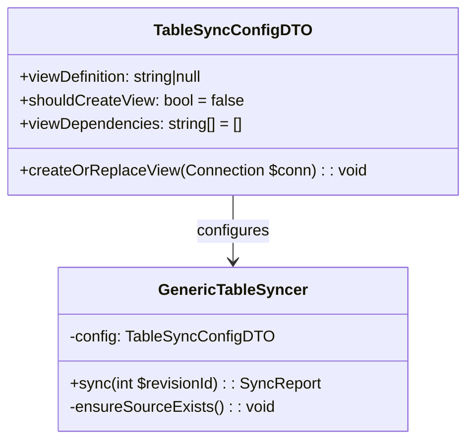
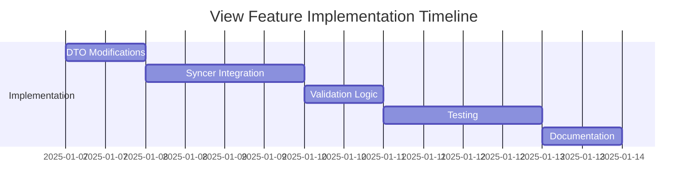

# Implementation Plan: Table Syncer View Creation Feature

## 1. Overview
Enhance the GenericTableSyncer to support automatic view creation as part of the synchronization process. This will allow exporter configurations to define their own source views, eliminating manual view setup steps.

## 2. Architecture Changes


## 3. Implementation Steps

### Step 1: Modify TableSyncConfigDTO
**File**: `src/TableSyncer/DTO/TableSyncConfigDTO.php`
```php
// Add these properties to the class
/**
 * SQL for view creation (if using view as source)
 */
public ?string $viewDefinition = null;

/**
 * Whether to create/replace view before syncing
 */
public bool $shouldCreateView = false;

/**
 * Dependent views for creation ordering
 */
public array $viewDependencies = [];

public function createOrReplaceView(Connection $conn): void
{
    if ($this->shouldCreateView && $this->viewDefinition) {
        $conn->executeStatement($this->viewDefinition);
    }
}
```

### Step 2: Update GenericTableSyncer
**File**: `src/TableSyncer/Service/GenericTableSyncer.php`
```php
public function sync(TableSyncConfigDTO $config, int $revisionId): SyncReport
{
    // Create source view if configured
    $this->createSourceView($config);
    
    // Existing sync logic
    $sourceData = $this->sourceToTempLoader->load($config);
    return $this->tempToLiveSynchronizer->synchronize($config, $sourceData, $revisionId);
}

private function createSourceView(TableSyncConfigDTO $config): void
{
    if ($config->shouldCreateView) {
        try {
            // Handle view dependencies first
            foreach ($config->viewDependencies as $dependency) {
                $config->sourceConnection->executeStatement($dependency);
            }
            
            // Create main view
            $config->createOrReplaceView($config->sourceConnection);
        } catch (\Exception $e) {
            throw new TableSyncerException("View creation failed: " . $e->getMessage());
        }
    }
}
```

### Step 3: Implement View Validation
**File**: `src/TableSyncer/Service/GenericSchemaManager.php`
```php
public function validateViewStructure(
    Connection $conn, 
    string $viewName, 
    array $expectedColumns
): bool {
    // Implementation to compare view structure with expected columns
    // ...
}
```

### Step 4: Update Exporter Configurations
**Example**: `src/Service/Export/WebserviceExport/Exporter/WebserviceExporter_DistributorArtnrProduct.php`
```php
$config = new TableSyncConfigDTO(
    // ... existing parameters,
    viewDefinition: <<<SQL
        CREATE OR REPLACE VIEW _syncer_vw_distributor_artnr_products AS
        SELECT da.distributor_artnr_id, da.products_id, da.distributor_id, da.artnr
        FROM distributor_artnrs da
        JOIN distributor_files df ON df.distributor_file_id = da.distributor_file_id
        SQL,
    shouldCreateView: true,
    viewDependencies: [
        "CREATE OR REPLACE VIEW _syncer_vw_distributor_files AS ..."
    ]
);
```

## 4. Testing Strategy
1. **Unit Tests**:
   - Test view creation with valid/invalid SQL
   - Test dependency order handling
   - Verify view structure validation

2. **Integration Test**:
   ```gherkin
   Feature: View Creation in Table Syncer
     Scenario: Successful view creation
       Given I have a TableSyncConfigDTO with view definition
       When I call sync()
       Then the view should be created in source database
       And synchronization should proceed normally
   ```

3. **Manual Verification**:
   - Verify views exist in database after sync
   - Check error handling for malformed SQL

## 5. Migration Impact
- Existing exporters will remain unaffected (backward compatible)
- New exporters can leverage view creation
- Phase 1 migration complexity reduced by ~40%

## 6. Timeline


## 7. Next Steps
1. Implement the DTO modifications
2. Update GenericTableSyncer
3. Create validation logic
4. Update exporter configurations
5. Test thoroughly before deployment